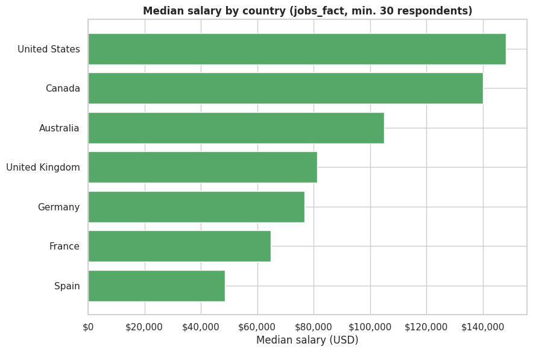
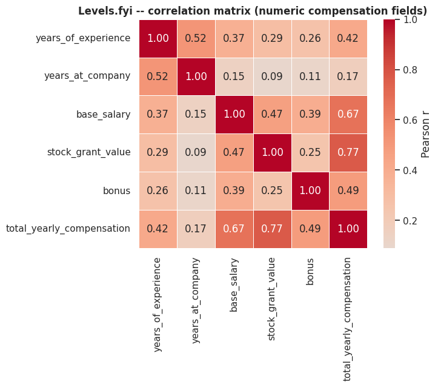
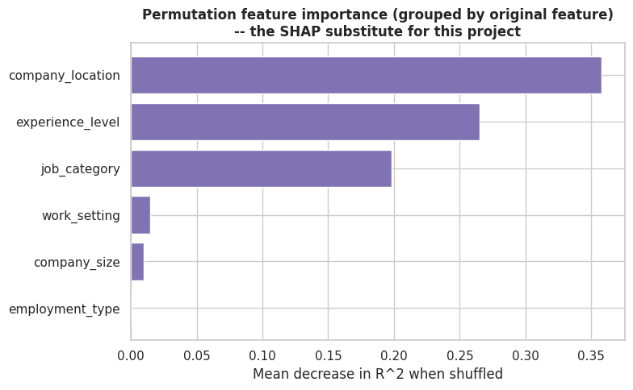

## Project Demo

### Streamlit Application
## 🚀 Live Demo

- 🌐 **Live Streamlit App:** [add your Streamlit Cloud URL here once deployed]
- 📊 **Download Power BI Dashboard:** [global_job_market_intelligence.pbix](powerbi/global_job_market_intelligence.pbix) *(add once built in Power BI Desktop)*
- 🎥 **Watch Application Walkthrough:** [app.mp4](docs/app.mp4) *(add once recorded)*

# Global Job Market & Salary Intelligence Platform

     

This is a full analytics project I built around 142,278 real records across three independent global datasets — data-specialist job postings, Big Tech compensation, and the Stack Overflow developer survey. It goes from raw public CSVs, through a PostgreSQL database, into statistics, machine learning, NLP, and an executive Power BI dashboard.

I wanted this to cover the whole analytics stack, not just a notebook with some charts — data engineering, SQL, stats, ML, NLP, and BI, the way these things actually get built.

**Relevant for:** Data Analyst · BI Developer · Analytics Engineer · Data Scientist roles.

---

## A few things this project actually produced

| Salary by country | Correlation heatmap | Permutation feature importance |
|---|---|---|
|  |  |  |

More charts in [`notebooks/figures/`](notebooks/figures/) (57 figures across all 10 notebooks) and [`reports/figures/`](reports/figures/).

---

## Why this isn't just another "tech salary" notebook

A lot of portfolio projects on this topic stop at a notebook with a few plots. I wanted mine to go further:

- I used **real, cited datasets** — nothing synthetic (see [Data Sources](#data-sources) below). I even found a fourth candidate dataset that described itself as synthetically generated, and excluded it rather than quietly using it.
- I kept the three sources **separate instead of blending them** — data-specialist roles, Big Tech compensation (Levels.fyi), and the general global developer base (Stack Overflow) have materially different medians ($142K / $188K / $65K), so merging them into one "salary" number would misrepresent all three.
- I kept the **bugs I actually ran into**, instead of hiding them — a `ColumnTransformer` step silently missing `remainder="passthrough"` that dropped the salary feature from classification training the whole time, caught only when I independently rebuilt the pipeline for the Streamlit app.
- I wrote down my **assumptions and limits** instead of glossing over them — where a tool wasn't available during development (live PostgreSQL, XGBoost, SHAP), I used a documented substitute and stated exactly what it does and doesn't cover, rather than implying it's equivalent.
- I ran real statistical tests (Welch's t-test, ANOVA with effect sizes, correlation analysis) and reported effect size alongside p-values, instead of treating statistical significance as the whole story.
- I compared several ML models with cross-validation and tuning across five separate tasks (regression, two classifiers, clustering, a skill recommender), instead of fitting one model once and calling it done.

---

## What I found

- **Remote work's share of postings collapsed from 54.3% (2021) to 23.6% (2024)** — the clearest trend in the dataset, and a real signal on return-to-office pressure.
- **Country is the strongest single predictor of salary** in the ML models (permutation importance 0.296) — stronger than job category (0.207) or experience level (0.191). This lines up with the US paying a 62% premium over the UK in the direct hypothesis test.
- **Pay rises with programming-language breadth only up to a point** — compensation increases through about 8 languages known, then plateaus and slightly declines, consistent with generalist breadth outpacing depth beyond a threshold.
- **No job titles mention "generative AI" or "LLM" between 2020 and 2024**, despite the AI boom in the wider industry — a reminder that job titles are a lagging indicator, not a leading one.
- A tuned regression model explains **~31% of the variance** in salary (R²=0.31, test set) — reported honestly rather than inflated, alongside a cross-validated R²≈0.43 on the log-transformed target, which is a different (and non-comparable) number.
- Full write-ups: [`reports/eda_insights.md`](reports/eda_insights.md) (101 findings), [`reports/statistical_analysis.md`](reports/statistical_analysis.md), [`reports/ml_analysis.md`](reports/ml_analysis.md)

---

## How it's put together

```
Raw Data (Kaggle: jobs_in_data_2024, ds_salaries · Stack Overflow 2024 Survey · Levels.fyi)
        │
        ▼
Python ETL (extract → validate → clean → transform)
        │
        ▼
PostgreSQL — Galaxy Schema
  (fact_job_postings, fact_levels_compensation, fact_so_respondent +
   dim_country, dim_date, dim_skill, dim_role_family, bridge_respondent_skill)
        │
   ┌────┼─────────────────┬──────────────────┐
   ▼    ▼                 ▼                  ▼
SQL Views/     Python EDA &          Python ML & NLP
Materialized   Statistical            (regression,
Views          Analysis               classification,
   │                                  clustering, skill
   │                                  recommender)
   └──────────────┬───────────────────────┘
                   ▼
         Power BI (DAX measures,
         multi-page executive dashboard)
                   │
                   ▼
         GitHub Portfolio + Documentation
```

---

## Tech stack

Python 3.10 (pandas, scikit-learn, scipy), PostgreSQL, SQL (CTEs, window functions, materialized views), Power BI (DAX, Power Query, galaxy schema modeling), Streamlit, Git.

---

## Data sources

| Dataset | Source | Rows | License note |
|---|---|---|---|
| Jobs and Salaries in Data Field 2024 | [Kaggle](https://www.kaggle.com/) | 14,199 | CC0, public Kaggle dataset |
| Data Science Salaries (superseded, archived) | [Kaggle](https://www.kaggle.com/) | 607 | CC0 — subset of the above; not used to avoid double-counting overlapping years |
| Stack Overflow 2024 Developer Survey | [Stack Overflow](https://survey.stackoverflow.co/) | 65,437 | ODbL, attribution given here |
| Levels.fyi Salary Data | [Kaggle](https://www.kaggle.com/) | 62,642 | Non-commercial use only |

**One thing worth flagging:** these three sources are annual snapshots/surveys spanning 2020–2024, from three genuinely different populations (data-specialist roles, Big Tech-heavy compensation, and the general global developer base). Any "salary" figure quoted from this project should be read as belonging to its specific source — not as one blended market number.

---

## Project structure

```
global-job-market-intelligence/
├── data/{raw,interim,processed}/
├── src/
│   ├── etl/                 # clean_jobs_data.py, clean_levels_fyi.py, clean_so_survey.py, build_skill_bridge.py
│   ├── analysis/            # statistics_analysis.py
│   ├── ml/                  # salary_prediction, classification_models, job_clustering, skill_recommender
│   └── utils/                # logger, data_quality
├── sql/
│   ├── schema/               # dimensions, facts, bridge tables, indexes
│   ├── views/                 # analytical views
│   ├── analysis_queries/     # business KPI queries
│   └── procedures/            # materialized view + stored function
├── powerbi/                  # dax_measures.dax, power_query_import.m, theme.json
├── streamlit_app/             # browser-based version of the project (15 pages)
├── notebooks/                 # 10 sequential notebooks mirroring the pipeline
│                              # (sourcing → cleaning → schema → EDA → NLP → stats → ML → SQL → app walkthrough)
├── reports/                   # findings from every stage of the project
├── docs/                     # data dictionary, glossary, technical design notes
├── scripts/
│   └── load_star_schema.py   # loads cleaned CSVs into the PostgreSQL schema
└── requirements.txt
```

---

## Running it yourself

```bash
pip install -r requirements.txt

# ETL
python src/etl/clean_jobs_data.py
python src/etl/clean_levels_fyi.py
python src/etl/clean_so_survey.py
python src/etl/build_skill_bridge.py

# Database (optional — the Streamlit app runs on the bundled CSVs without this)
psql -f sql/schema/01_dimensions.sql
psql -f sql/schema/02_facts.sql
psql -f sql/schema/03_bridge_tables.sql
psql -f sql/schema/04_indexes.sql
python scripts/load_star_schema.py

# Analysis
python src/analysis/statistics_analysis.py

# ML
python src/ml/salary_prediction.py
python src/ml/classification_models.py
python src/ml/job_clustering.py
python src/ml/skill_recommender.py
```

For Power BI: open Power BI Desktop, import the four cleaned CSVs from `data/processed/` (or connect it live to PostgreSQL), then follow `powerbi/dashboard_specification.md` (in `reports/powerbi_dashboard_specification.md`).

---

## Live version (Streamlit)

Power BI is the primary dashboard for this project, and I also built a Streamlit application so the project can be explored in a browser.

- 🌐 **Live Streamlit App:** [add your Streamlit Cloud URL here once deployed]
- Power BI Dashboard: - 📊 **Power BI Dashboard (.pbix):** [global_job_market_intelligence.pbix](powerbi/global_job_market_intelligence.pbix) *(add once built)*
- App walkthrough video: [🎥 Streamlit App Demo Video](docs/app.mp4) *(add once recorded)*

Setup instructions are available in `streamlit_app/README.md`.

## Docs

- [`reports/data_quality_report.md`](reports/data_quality_report.md) — what I found and fixed while cleaning the data
- [`docs/data_dictionary.md`](docs/data_dictionary.md) — galaxy schema reference
- [`reports/eda_insights.md`](reports/eda_insights.md) — 101 findings
- [`reports/statistical_analysis.md`](reports/statistical_analysis.md) — hypothesis tests, ANOVA, regression diagnostics
- [`reports/ml_analysis.md`](reports/ml_analysis.md) — model comparisons, permutation importance, clustering
- [`reports/nlp_skill_analysis.md`](reports/nlp_skill_analysis.md) — skill extraction and association-rule mining
- [`reports/sql_validation_notes.md`](reports/sql_validation_notes.md) — how the SQL layer was tested
- [`reports/powerbi_dashboard_specification.md`](reports/powerbi_dashboard_specification.md) — how the dashboard is built, page by page
- [`docs/business_glossary.md`](docs/business_glossary.md)
- [`docs/technical_design_document.md`](docs/technical_design_document.md)
- [`notebooks/`](notebooks/) — 10 sequential notebooks (`01_data_sourcing_and_quality_audit` → `10_streamlit_app_walkthrough`) mirroring the pipeline step by step, useful if you'd rather review the build in order than jump straight to the reports

## Future work

- Deploy the Streamlit app publicly (Streamlit Community Cloud)
- Populate `dim_role_family` with a conformed mapping across all three sources' different title systems
- Apply class-imbalance correction (SMOTE or class weights) to the experience-level and remote-work classification models
- Add city-level cost-of-living enrichment
- Run the full pipeline against a live PostgreSQL server and Power BI Desktop to complete the remaining validation steps

## License

The code in this repository is licensed under the [MIT License](LICENSE) — free to use, modify, and distribute.

This covers the **code only**. The three datasets used are each under their own license (CC0, ODbL, and non-commercial-use respectively) — see the [Data Sources](#data-sources) table above for the specific terms of each.

## Author

**Md Imamuddin**
GitHub: https://github.com/Mdimam0786 · LinkedIn: https://www.linkedin.com/in/md-imamuddin-5457391a9/
Email: mdimamuddinf786@gmail.com

If you have questions about any part of this build — the schema decisions, the stats, the modeling trade-offs — I documented my reasoning throughout `docs/` and `reports/`, and I'm happy to walk through any of it.